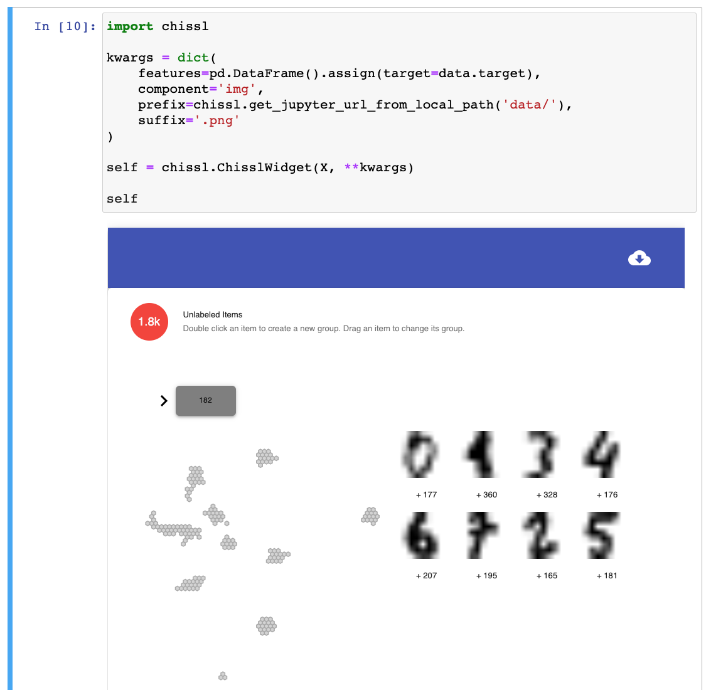

# Introduction 

Welcome to CHISSL, an interactive machine learning prototype. It is designed to provide a novel, simpler way for non-expert users to quickly and effortlessly explore large datasets without becoming overwhelmed.



The system provides a few recommendations to start with. Then, the user can double-click on one or more instances to create a group. For each group the user has created, CHISSL will recommend a few more things for the user to look at that it thinks is most similar to the examples(s) the user has provided. More than one example can be provided per group, and the user is free to correct the recommendations when they do not agree with her mental model.

CHISSL also recommends a borderline instance for each group to check out. Borderlines are likely to belong in another group.

Clicking below instances will show more instances on the sidebar that are similar to that example. Bars on the time histogram will similarly reveal instances within that time window.

# Jupyter Widget Branch
This branch of the code adapts CHISSL as a [Jupyter Widget](https://github.com/jupyter-widgets/widget-cookiecutter), which is an interactive cell in the [Jupyter Notebook](https://jupyter.org) computatinal environment. This removes the backend requirements, including MongoDB, and allows data scientists familiar with Jupyter Notebook to more easily use the tool.


# Getting Started
## Quick Installation
```sh
cd widget
pip install .
jupyter nbextension install --py chissl
jupyter nbextension enable --py chissl
```

## Uninstall
To uninstall CHISSL, you will want to run the following commands:
```sh
jupyter nbextension uninstall chissl-widget
pip uninstall chissl
```
This will be necessary if you need to install a newer version of the 

## Developer Installation
If you plan to add new JavaScipt visualizations to CHISSL, you will want to do a developer installation by running
```sh
bash setup-develop.sh
```
This actually executes a sequences of commands to setup the multple develop environments (both JavaScript and python) for the tool, which is shown below for reference.
```sh
npm install
npm run build-css
npm run build -- --copy-files --no-demo
cd widget/js
npm install
npm run prepublish
cd ..
pip install -e .
cd ..
jupyter nbextension install --py --symlink --sys-prefix chissl
jupyter nbextension enable --py --sys-prefix chissl
```

## Examples
Check out the examples which show how to use CHISSL for image and text use cases.
* notebooks/digits/Digits.ipynb 
* notebooks/twenty-newsgroups/newsgroups.ipynb

These will walk you though how you need to prepare your representation matrix and corresponding JSON files for each data instance. Because there is no backend in this version, each data instance is copied to disk and then accessed through an HTTP request. The examples show you how to piggyback on Jupyter to host your data, but this is not required. Advanced users could/should setup a REST API instead.

### Run digits
The notebook will not run properly in VS Code. You must open it with `jupyter-notebook` in the web browser.
```bash
cd notebooks/digits
jupyter-notebook Digits.ipynb
```

# Adding Custom Instance Visualizations
If you want to add applications beyond the image or text use cases, you will need to create a custom visualization. You will modify the following files:
* src/components/icons/MyNewComponent.js
* src/components/icons/index.js

You will create a React component to render your instance. The component will be passed the instance document directly from the database as props.

```jsx
import React from 'react';

import './MyNewComponent.css'

export const MyNewComponent = ({_id, date, tags, ...rest}) =>
    <div className='my-new-component'>
        <div>{_id}</div>

        <div>{date}</div>

        <div>{tags}</div>

        Secret sauce goes here.
    </div>
```

If you want to use CSS, create `MyNewComponent.scss` namespaced as shown below. This will be automatically compiled into a CSS file which you include in the component. Don't include the .scss file.

```scss
.my-new-component {
  div {
    font-family: "Comic Sans MS";
  }
}
```

Export your component in `src/components/icons/index.js`.

```js
export {MyNewComponent} from './MyNewComponent';
```

# How to Cite
If you this work inspires your research, please cite the following paper:

[Arendt, Dustin, et al. "Towards rapid interactive machine learning: evaluating tradeoffs of classification without representation." Proceedings of the 24th International Conference on Intelligent User Interfaces. ACM, 2019.](https://dl.acm.org/citation.cfm?id=3301275.3302280)
```
@inproceedings{arendt2019towards,
  title={Towards rapid interactive machine learning: evaluating tradeoffs of classification without representation},
  author={Arendt, Dustin and Saldanha, Emily and Wesslen, Ryan and Volkova, Svitlana and Dou, Wenwen},
  booktitle={Proceedings of the 24th International Conference on Intelligent User Interfaces},
  pages={591--602},
  year={2019},
  organization={ACM}
}
```
